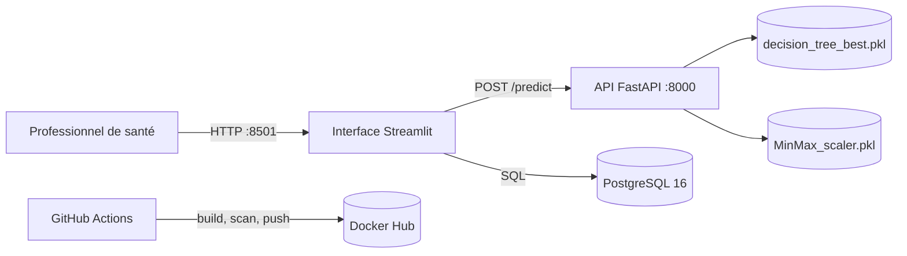
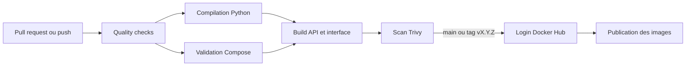

<div align="center">
  
  <h1>OncoScan AI</h1>
  <p><strong>Outil d'aide à la décision pour la classification de tumeurs mammaires.</strong></p>

  <p>
    
    
    
    
    
    
    
    
  </p>
</div>

> **Avertissement médical** : OncoScan AI est un projet personnel à but pédagogique. Il ne constitue pas un diagnostic médical et ne remplace pas professionnel de santé.

## Sommaire

- [1. Présentation](#1-présentation)
- [2. Architecture](#2-architecture)
- [3. Fonctionnement](#3-fonctionnement)
- [4. Modèle et données](#4-modèle-et-données)
- [5. Prérequis](#5-prérequis)
- [6. Installation locale](#6-installation-locale)
- [7. Utilisation quotidienne](#7-utilisation-quotidienne)
- [8. Services](#8-services)
- [9. Dockerfiles et Compose](#9-dockerfiles-et-compose)
- [10. CI/CD et Docker Hub](#10-cicd-et-docker-hub)
- [11. Variables d'environnement](#11-variables-denvironnement)
- [12. Structure du projet](#12-structure-du-projet)
- [13. Dépannage](#13-dépannage)
- [14. Limites et évolutions](#14-limites-et-évolutions)
- [15. Licence](#15-licence)

## 1. Présentation

OncoScan AI expose un modèle de machine learning déjà entraîné pour classer des mesures morphologiques cellulaires en deux catégories :

- `M` : classe maligne ;
- `B` : classe bénigne.

Le projet est organisé en trois services Docker :

1. une interface web Streamlit utilisée par les professionnels de santé ;
2. une API FastAPI responsable de l'inférence du modèle ;
3. une base PostgreSQL qui conserve les comptes et l'historique des prédictions.

L'application démontre le déploiement d'un modèle ML avec chargement d'artefacts `.pkl`, validation des entrées, communication REST, persistance des résultats, conteneurisation et livraison continue.

## 2. Architecture



### Réseau et exposition

- `interface` est le seul service exposé sur la machine hôte : `http://localhost:8501`.
- `api` et `postgres` sont accessibles uniquement par le réseau interne Docker Compose.
- Streamlit appelle l'API avec `http://api:8000/predict`, car `api` est le nom DNS du service Compose.
- Les modèles sont montés dans l'API en lecture seule depuis `Save_models/`.
- PostgreSQL utilise le volume nommé `pgdata` afin de conserver les données lors d'un simple redémarrage.

## 3. Fonctionnement

1. Le professionnel ouvre l'interface Streamlit.
2. Il crée un compte ou se connecte ; le mot de passe est vérifié avec `bcrypt`.
3. Il saisit les huit mesures attendues par le modèle.
4. Streamlit envoie un `POST /predict` à FastAPI avec l'en-tête `X-API-Key`.
5. FastAPI valide les données avec Pydantic.
6. FastAPI applique le scaler chargé depuis `MinMax_scaler.pkl`.
7. Le modèle chargé depuis `decision_tree_best.pkl` produit la classe et, si disponible, une probabilité.
8. Streamlit affiche le résultat et enregistre l'analyse dans PostgreSQL.
9. L'utilisateur peut consulter son historique filtré.

## 4. Modèle et données

### Artefacts fournis

Le projet ne réentraîne pas le modèle au démarrage. Il utilise deux artefacts déjà entraînés et sérialisés au format Pickle :

| Fichier | Rôle |
|---|---|
| `Save_models/decision_tree_best.pkl` | Modèle de classification déjà entraîné |
| `Save_models/MinMax_scaler.pkl` | Transformation des huit variables avant inférence |

Le chargement de fichiers Pickle doit être réservé à des artefacts de confiance : un fichier Pickle peut exécuter du code lors de sa désérialisation.

### Variables envoyées à l'API

| Champ | Bornes appliquées |
|---|---:|
| `texture_worst` | `10.0 < x <= 50.0` |
| `area_worst` | `150.0 < x <= 4300.0` |
| `smoothness_worst` | `0.05 < x <= 0.25` |
| `compactness_worst` | `0.02 <= x <= 1.10` |
| `concavity_worst` | `0.01 <= x <= 1.30` |
| `concave_points_worst` | `0.02 <= x <= 0.40` |
| `symmetry_worst` | `0.10 < x <= 0.70` |
| `fractal_dimension_worst` | `0.04 < x <= 0.22` |

Les mêmes bornes sont contrôlées à trois niveaux : interface, API et base de données.

### API REST

L'API est documentée automatiquement par FastAPI. Elle écoute sur le port interne `8000`.

#### `GET /`

Retourne le nom et la version de l'application.

#### `GET /health`

Vérifie que le modèle et le scaler sont chargés.

```json
{
  "status": "healthy",
  "model_loaded": true,
  "scaler_loaded": true,
  "model_version": "1.2.0"
}
```

#### `POST /predict`

```http
X-API-Key: votre-cle-api
Content-Type: application/json
```

Exemple de requête :

```json
{
  "texture_worst": 25.3,
  "area_worst": 850.0,
  "smoothness_worst": 0.14,
  "compactness_worst": 0.28,
  "concavity_worst": 0.32,
  "concave_points_worst": 0.15,
  "symmetry_worst": 0.29,
  "fractal_dimension_worst": 0.08
}
```

Exemple de réponse :

```json
{
  "prediction": "M",
  "label": "Maligne",
  "probability": 0.923,
  "model_version": "1.2.0"
}
```

## 5. Prérequis

- Docker Desktop récent ;
- Docker Compose v2 ;
- Git ;
- un compte Docker Hub pour publier les images ;
- les deux fichiers `.pkl` présents dans `Save_models/`.

Python `3.12` est recommandé pour les vérifications locales.

## 6. Installation locale

### 6.1 Cloner le dépôt

```bash
git clone https://github.com/<votre-utilisateur>/<votre-repository>.git
cd API-Docker-GithubActions
```

### 6.2 Préparer les variables

Ne commitez jamais `.env` : il contient des secrets.

```bash
cp .env.example .env
```

Sous PowerShell :

```powershell
Copy-Item .env.example .env
```

Modifiez ensuite `.env` :

```dotenv
DB_NAME=oncoscan
DB_USER=oncoscan
DB_PASSWORD=un-mot-de-passe-long-et-aleatoire
API_KEY=une-cle-api-longue-et-aleatoire
ALLOWED_ORIGINS=
VERSION=1.4.0
```

### 6.3 Vérifier et démarrer

```bash
docker compose config --quiet
docker compose up --build -d
docker compose ps
```

Ouvrir l'interface : [http://localhost:8501](http://localhost:8501)

## 7. Utilisation quotidienne

### Logs et état

```bash
docker compose ps
docker compose logs -f
docker compose logs -f api
docker compose logs -f interface
docker compose logs -f postgres
```

### Rebuild et redémarrage

```bash
docker compose build api
docker compose build interface
docker compose restart api
docker compose restart interface
```

### Arrêt

```bash
docker compose down
```

Cette commande conserve le volume PostgreSQL.

Pour supprimer aussi les comptes et l'historique :

```bash
docker compose down -v
```

### Shell et PostgreSQL

```bash
docker compose exec api sh
docker compose exec postgres psql -U "$DB_USER" -d "$DB_NAME"
```

## 8. Services

### Interface web — `Interface/`

Technologie : Streamlit.

Responsabilités : authentification des praticiens, saisie contrôlée, appel REST, affichage du résultat et consultation de l'historique PostgreSQL.

Dépendances : `Interface/requirements_interface.txt`.

### API d'inférence — `Api/`

Technologies : FastAPI, Uvicorn, Pydantic, pandas et scikit-learn.

Responsabilités : charger et vérifier les artefacts, valider les requêtes JSON, exécuter l'inférence et fournir les endpoints REST et de santé.

Dépendances : `Api/requirements_api.txt`.

### Base de données — `Database/`

Technologie : PostgreSQL 16 Alpine.

`Database/schema.sql` crée les tables `users` et `predictions`, la relation `predictions.user_id -> users.id`, les contraintes de bornes et les index nécessaires à l'historique.

Le script d'initialisation n'est exécuté automatiquement que lors de la création initiale du volume. En production, une évolution de schéma doit passer par une migration versionnée.

## 9. Dockerfiles et Compose

### Construction des images

Les deux Dockerfiles utilisent une construction multi-stage :

1. une étape builder installe les dépendances ;
2. une image runtime séparée reçoit uniquement l'environnement et le code nécessaires ;
3. le processus s'exécute avec un utilisateur non-root ;
4. un healthcheck vérifie le service ;
5. l'image expose uniquement le port interne nécessaire.

L'API démarre avec Uvicorn sur `8000`. L'interface démarre avec Streamlit sur `8501`.

### Orchestration Compose

`docker-compose.yml` :

- démarre PostgreSQL avec un healthcheck ;
- monte `Database/schema.sql` en lecture seule à l'initialisation ;
- monte les modèles en lecture seule dans l'API ;
- attend que PostgreSQL et l'API soient healthy avant l'interface ;
- injecte les variables nécessaires par service ;
- conserve les données dans `pgdata` ;
- publie uniquement le port `8501` sur l'hôte.

## 10. CI/CD et Docker Hub

Le workflow [`.github/workflows/ci-cd.yml`](.github/workflows/ci-cd.yml) suit ce flux :



### Déclencheurs

- pull request vers `main` : contrôles, build et scan, sans publication ;
- push sur `main` : contrôles, build, scan et publication ;
- tag `vX.Y.Z` : contrôles, build, scan et publication ;
- lancement manuel avec `workflow_dispatch`.

### Étapes automatisées

1. compilation de `Api/` et `Interface/` ;
2. validation de `docker-compose.yml` avec des variables CI ;
3. build des deux images avec Buildx et cache GitHub Actions ;
4. scan Trivy des vulnérabilités `HIGH` et `CRITICAL` ;
5. publication uniquement si toutes les étapes précédentes réussissent.

### Secrets GitHub

Dans **Settings → Secrets and variables → Actions**, créer :

| Secret | Contenu |
|---|---|
| `DOCKERHUB_USERNAME` | Nom du compte Docker Hub |
| `DOCKERHUB_TOKEN` | Access Token Docker Hub, jamais le mot de passe du compte |

Repositories Docker Hub attendus :

- `<DOCKERHUB_USERNAME>/oncoscan-api`
- `<DOCKERHUB_USERNAME>/oncoscan-interface`

### Versionner et publier

```bash
git add .
git commit -m "release: prepare v1.4.0"
git push origin main
```

Pour une version immuable :

```bash
git tag v1.4.0
git push origin v1.4.0
```

Le workflow produit notamment `latest`, `sha-<commit>` et `v1.4.0` pour un tag Git.

## 11. Variables d'environnement

| Variable | Services | Rôle |
|---|---|---|
| `DB_NAME` | PostgreSQL, interface | Nom de la base |
| `DB_USER` | PostgreSQL, interface | Utilisateur PostgreSQL |
| `DB_PASSWORD` | PostgreSQL, interface | Mot de passe PostgreSQL |
| `API_KEY` | API, interface | Authentification des appels `/predict` |
| `ALLOWED_ORIGINS` | API | Origines CORS autorisées, facultatif |
| `VERSION` | Compose | Tag local des images |
| `API_URL` | Interface | URL interne de l'endpoint de prédiction |
| `MODEL_PATH` | API | Chemin du modèle dans le conteneur |
| `SCALER_PATH` | API | Chemin du scaler dans le conteneur |

Les valeurs sensibles doivent rester dans `.env` localement ou dans un gestionnaire de secrets en production. `.env.example` ne contient aucune valeur réelle.

## 12. Structure du projet

```text
API-Docker-GithubActions/
├── .github/workflows/ci-cd.yml        # Pipeline GitHub Actions
├── Api/
│   ├── api.py                         # API FastAPI et inférence
│   ├── Dockerfile                     # Image de l'API
│   └── requirements_api.txt           # Dépendances API
├── Database/schema.sql                 # Schéma PostgreSQL
├── Interface/
│   ├── app.py                         # Interface Streamlit
│   ├── Dockerfile                     # Image de l'interface
│   ├── favicon.svg                    # Favicon OncoScan
│   └── requirements_interface.txt     # Dépendances Streamlit
├── Save_models/
│   ├── decision_tree_best.pkl         # Modèle pré-entraîné
│   └── MinMax_scaler.pkl              # Scaler pré-entraîné
├── .dockerignore
├── .env.example
├── .gitignore
├── docker-compose.yml
├── LICENSE
└── README.md
```

## 13. Dépannage

### Variable Compose manquante

```bash
docker compose config
```

Vérifier que `.env` contient `DB_NAME`, `DB_USER`, `DB_PASSWORD`, `API_KEY` et `VERSION`.

### API unhealthy

```bash
docker compose logs api
```

Vérifier la présence de :

```text
Save_models/decision_tree_best.pkl
Save_models/MinMax_scaler.pkl
```

### Interface et PostgreSQL

L'interface doit utiliser `DB_HOST=postgres`, jamais `localhost` dans Docker.

```bash
docker compose ps
docker compose logs postgres interface
```

### Schéma non mis à jour

Les scripts d'initialisation ne sont joués qu'une fois par volume. Pour une démonstration sans données à conserver :

```bash
docker compose down -v
docker compose up --build -d
```

En production, appliquer une migration contrôlée et sauvegarder la base avant toute modification.

## 14. Limites et évolutions

Pour une production médicale réelle, prévoir notamment :

- migrations de base de données versionnées ;
- tests unitaires et tests d'intégration automatisés ;
- gestion de secrets dédiée ;
- HTTPS derrière un reverse proxy ;
- authentification avec sessions sécurisées ;
- journalisation et supervision centralisées ;
- validation clinique, traçabilité et gouvernance des modèles ;
- versionnement des modèles et vérification de leur empreinte ;
- limitation de débit et sauvegardes PostgreSQL.

## 15. Licence

Ce projet est distribué sous licence MIT. Voir [LICENSE](LICENSE).

Copyright (c) 2026 @Madiba

---

<div align="center">
  <strong>OncoScan AI</strong> · Projet pédagogique MLOps · @Madiba
</div>
